Supplementary Figures
---------------------

.. _fig-s1:

Supplementary Figure 1: Determining SNP linkage intervals
^^^^^^^^^^^^^^^^^^^^^^^^^^^^^^^^^^^^^^^^^^^^^^^^^^^^^^^^^

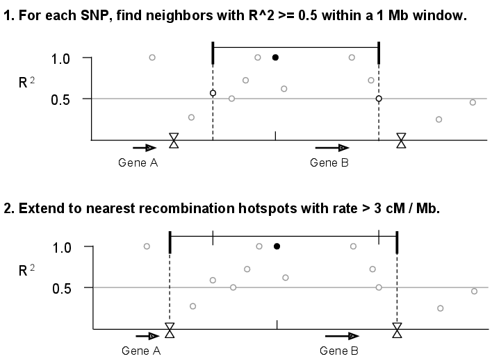

We calculated :math:`r^{2}` values for all pairs of SNPs within a 1 Mb
sliding window along each chromosome. Next, we assigned each of the SNPs
from The 1000 Genomes Project Phase I (1000 Genomes Consortium 2012) to
a linkage interval by identifying each SNP’s furthest upstream and
downstream neighbors with :math:`r^{2}\ge0.5`. Finally, we extended each
interval to recombination hotspots reported by HapMap (Myers *et al.*
2005) with recombination rate >3 cM/Mb.

.. _fig-s2:

Supplementary Figure 2: Counting genes in GWAS SNP linkage intervals
^^^^^^^^^^^^^^^^^^^^^^^^^^^^^^^^^^^^^^^^^^^^^^^^^^^^^^^^^^^^^^^^^^^^

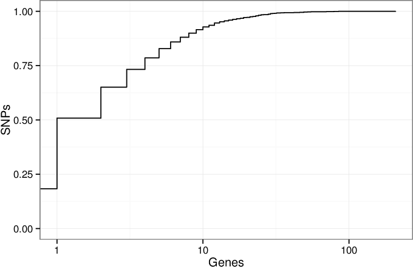

A cumulative density plot of the number of genes overlapped by the
linkage intervals of GWAS SNPs. We downloaded the GWAS Catalog SNPs on
January 17, 2014 and selected the 11,561 SNPs present in the 1000
Genomes Project (1000 Genomes Consortium 2012). Of these SNPs, 2,119
(18%) of them have linkage disequilibrium (LD) intervals that overlap no
genes, and 3,756 (32%) overlap a single gene. The remaining 50% of SNPs
overlap 2 or more genes. This illustrates the critical issue that many
SNPs implicate more than one gene.

.. _fig-s3:

Supplementary Figure 3: Choosing the :math:`r^{2}` threshold for linkage intervals
^^^^^^^^^^^^^^^^^^^^^^^^^^^^^^^^^^^^^^^^^^^^^^^^^^^^^^^^^^^^^^^^^^^^^^^^^^^^^^^^^^

We chose to use :math:`r^{2}\geq0.5` due to previous experience (Rossin
*et al.* 2011). To investigate if this choice influences SNPsea results,
we repeated the analysis of 45 red blood cell count-associated SNPs (Van
der Harst *et al.* 2012) using 5 different thresholds (:math:`r^{2}\ge`
0.2, 0.4, 0.6, 0.8, 1.0). We also did this for SNPs associated with
multiple sclerosis, celiac disease, and HDL cholesterol.

|image2|

|image3|

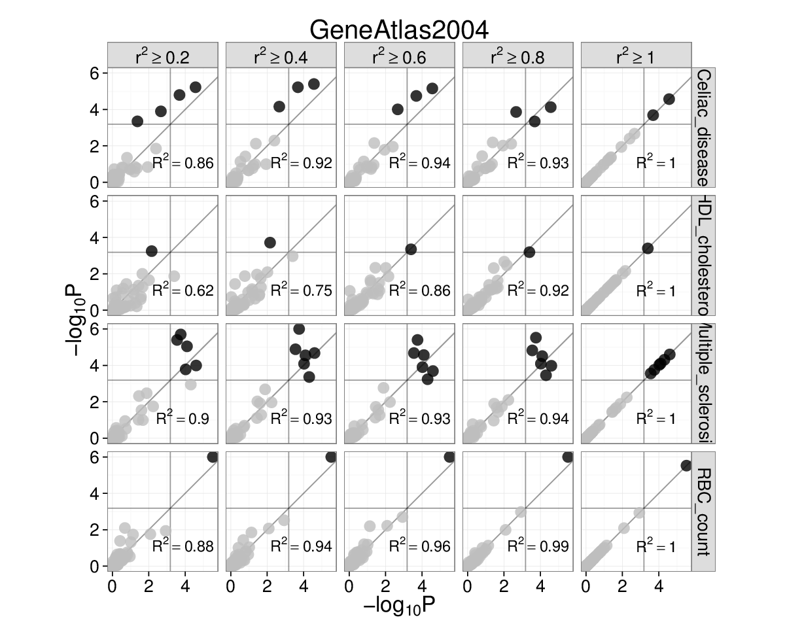
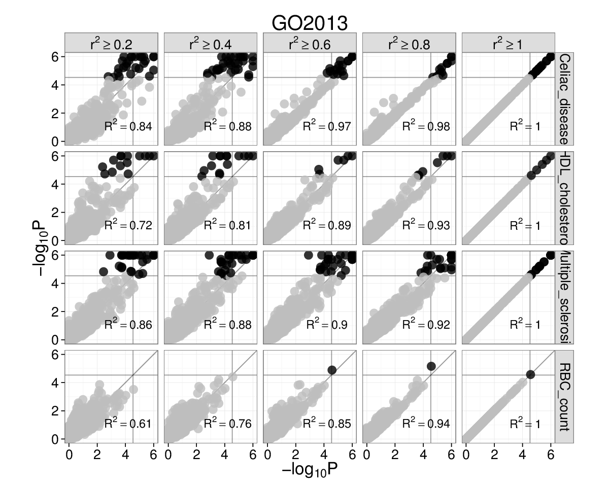

Gene Atlas and Gene Ontology (left and right). Each subplot has
:math:`-\text{log}_{10}P` for :math:`r^{2}=1` on the x-axis and
:math:`-\text{log}_{10}P` on the y-axis for the :math:`r^{2}` threshold
marked above. Grey lines are significance thresholds after correction
testing multiple conditions (cell types, GO annotations). Black points
are significant and grey are not. We used the ``’--score single’``
option. Red blood cell count SNPs are enriched for *hemopoiesis*
(GO:0030097) (:math:`P=2\times10^{-5}`) for linkage intervals with
:math:`r^{2}=(0.6,0.8,1.0)`. This result falls below the multiple
testing threshold at :math:`r^{2}\ge0.4`, but remains significant at
:math:`r^{2}\ge0.5` (see main text).

.. _fig-s4:

Supplementary Figure 4: Each trait-associated locus harbors a single associated gene
^^^^^^^^^^^^^^^^^^^^^^^^^^^^^^^^^^^^^^^^^^^^^^^^^^^^^^^^^^^^^^^^^^^^^^^^^^^^^^^^^^^^

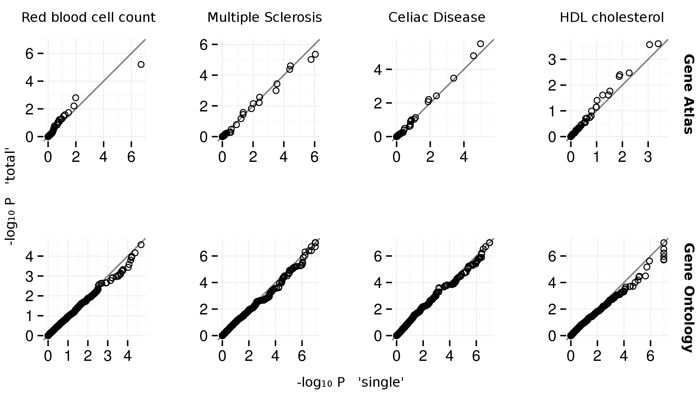

Quantile-quantile plots for Gene Atlas (Su *et al.* 2004) and Gene
Ontology (top and bottom). The x and y axes are
:math:`-\text{log}_{10}P` for ``’--score single’ and ’--score total’``
SNPsea options, respectively. The ``’single’`` and ``’total’`` methods
are described . The :math:`P`-values appear similar between methods.

.. _fig-s5:

Supplementary Figure 5: Type 1 error estimates
^^^^^^^^^^^^^^^^^^^^^^^^^^^^^^^^^^^^^^^^^^^^^^

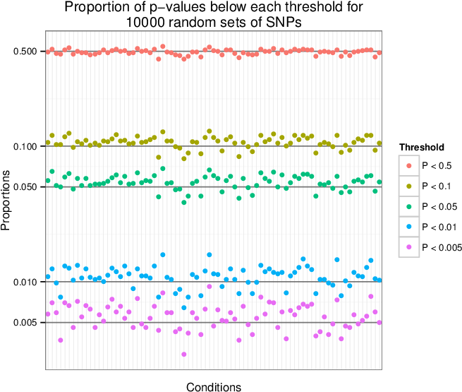

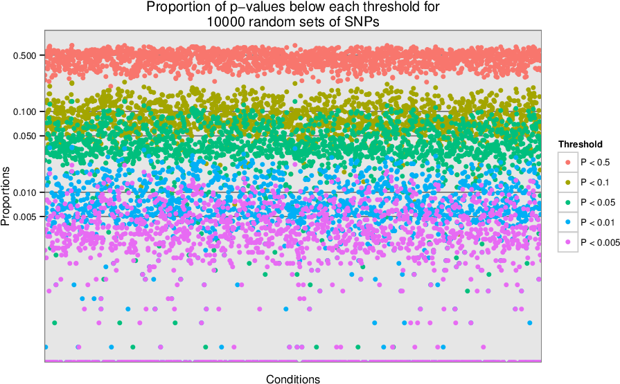

We sampled 10,000 sets of 100 SNPs uniformly from a list of LD-pruned
SNPs (Lango Allen *et al.* 2010). We tested each of the 10,000 sets for
enrichment of tissue-specific expression in the Gene Atlas (Su *et al.*
2004) gene expression matrix (top) and for enrichment of annotation with
Gene Ontology terms (bottom). For each condition, we show the proportion
of the 10,000 enrichment p-values that are below the given thresholds.
We observe that the p-values are near the expected values, so the type 1
(false positive) error rate is well-calibrated.

Additional Examples
===================

We tested SNPsea with the three additional phenotypes listed below with
genome-wide significant SNPs :math:`(P\leq5\times10^{-8})`. When
multiple SNPs implicated the same genes, we merged them into a single
locus. We tested each phenotype with the Gene Atlas and GO matrices with
the ``’--score single’`` option. The adjacent heatmaps show Pearson
correlation coefficients for all pairs of conditions.

+----------------------+--------+--------+--------------------------------------------+
| Phenotype            | SNPs   | Loci   | Reference                                  |
+======================+========+========+============================================+
| Multiple sclerosis   | 51     | 47     | Supp. Table A (IMSGC WTCCC 2011)           |
+----------------------+--------+--------+--------------------------------------------+
| Celiac disease       | 35     | 34     | Table 2 (Trynka, *et al.* 2011)            |
+----------------------+--------+--------+--------------------------------------------+
| HDL cholesterol      | 46     | 46     | Supp. Table 2 (Teslovich, *et al.* 2010)   |
+----------------------+--------+--------+--------------------------------------------+

.. _fig-s6:

Supplementary Figure 6: Red blood cell count GO enrichment
^^^^^^^^^^^^^^^^^^^^^^^^^^^^^^^^^^^^^^^^^^^^^^^^^^^^^^^^^^

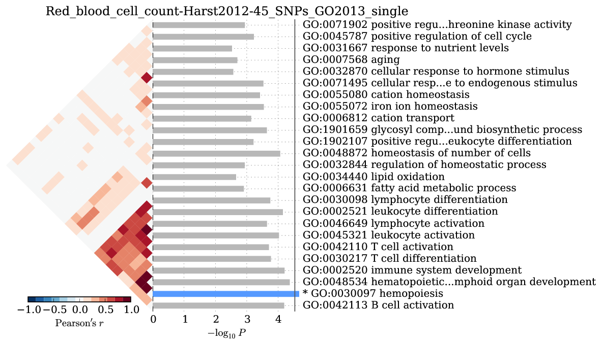

We observed significant enrichment for *hemopoiesis*
:math:`(2\times10^{-5})`. The top 25 terms are shown.

.. _fig-s7:

Supplementary Figure 7: Multiple sclerosis
^^^^^^^^^^^^^^^^^^^^^^^^^^^^^^^^^^^^^^^^^^

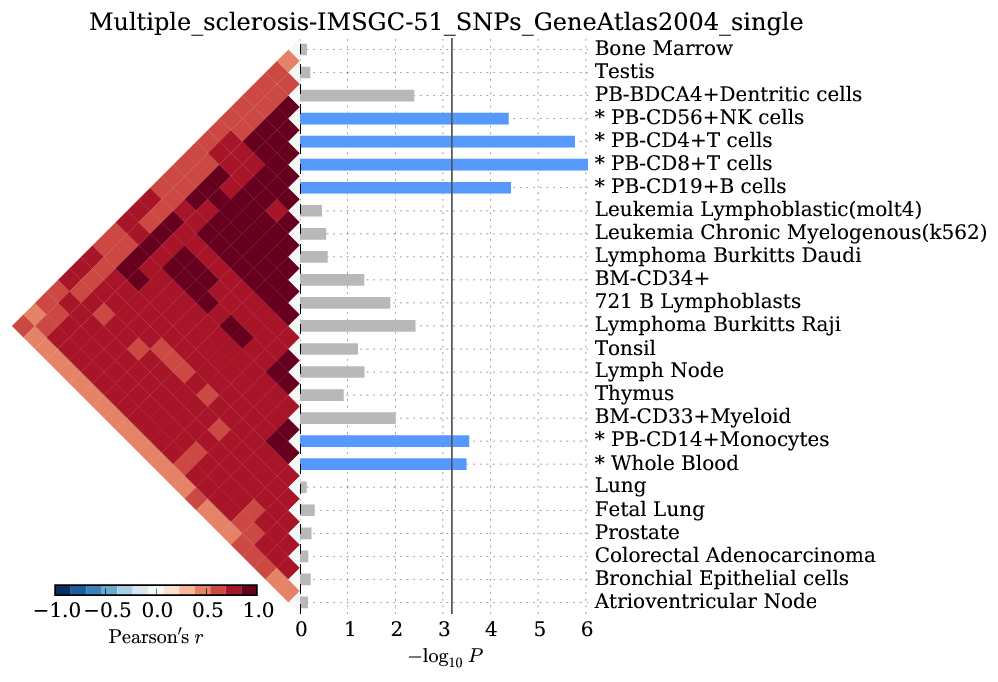

We observed significant enrichment for 6 cell types. The top 25 of 79
are shown.

.. figure:: figures/Multiple_sclerosis-IMSGC-51_SNPs-GO2013-single-pvalues_barplot.png
   :alt: 

We observed significant enrichment for 52 Gene Ontology terms. The top
60 terms are shown.

.. _fig-s8:

Supplementary Figure 8: Celiac disease
^^^^^^^^^^^^^^^^^^^^^^^^^^^^^^^^^^^^^^

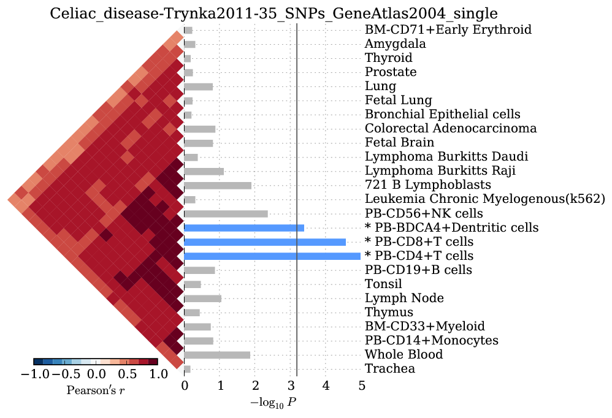

We observed significant enrichment for 3 cell types. The top 25 of 79
are shown.

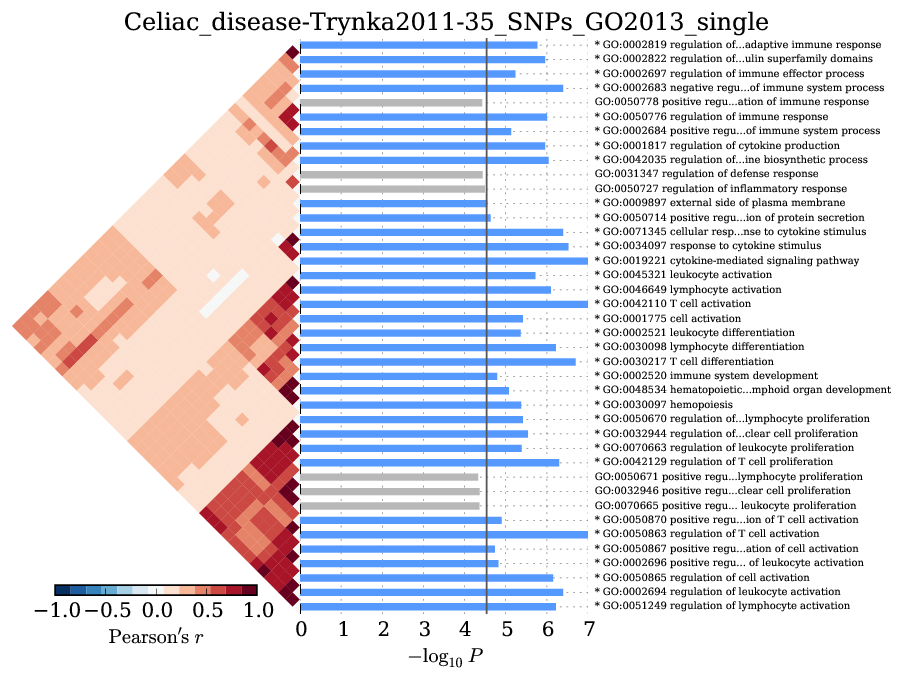

We observed significant enrichment for 28 Gene Ontology terms. The top
40 terms are shown.

.. _fig-s9:

Supplementary Figure 9: HDL cholesterol
^^^^^^^^^^^^^^^^^^^^^^^^^^^^^^^^^^^^^^^

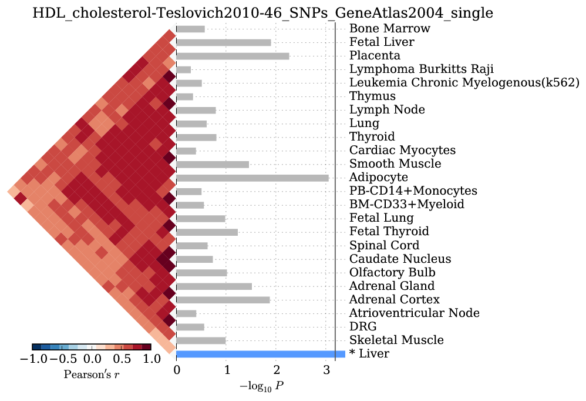

We observed significant enrichment for liver tissue-specific gene
expression. The top 25 of 79 are shown.

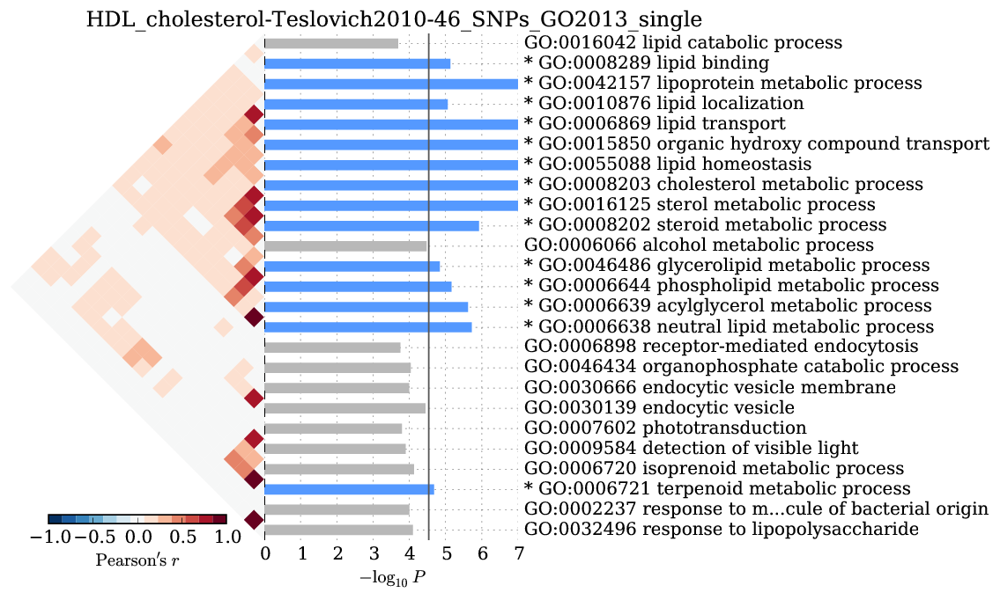

We observed significant enrichment for 13 Gene Ontology terms. The top
25 terms are shown.

