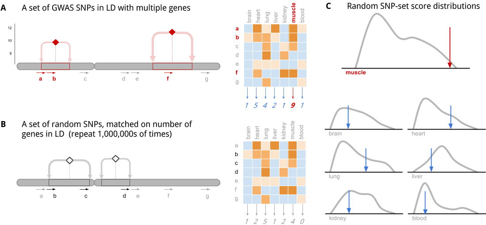
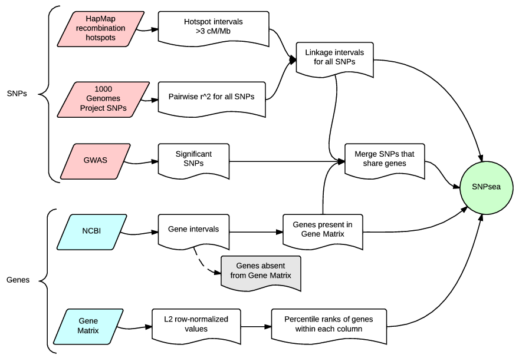

Visual Summary
--------------

Cartoon
~~~~~~~

This cartoon illustrates the key ideas of the algorithm:

**A\|** Step 1. Each SNP in a set of disease-associated SNPs is in
linkage disequilibrium (LD) with multiple genes. The genes are scored,
in aggregate, for specificity to each tissue.

**B\|** Step 2: The algorithm is repeated with random null SNP sets that
are not associated with any phenotype. These have been selected from an
LD-pruned list of SNPs, so the whole genome is covered.

**C\|** Step 3: The random SNP set scores form the null distributions
which allows us to determine statistical significance for enrichment of
specificity to a particular tissue/cell-type/condition.

Flow Chart
~~~~~~~~~~

This flow chart shows the input data required to perform the analysis,
and a summary of the intermediate steps.

